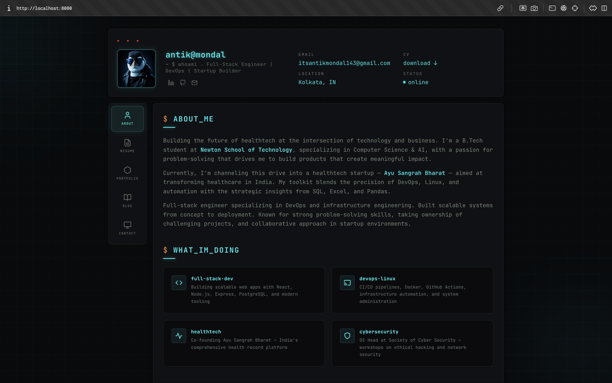
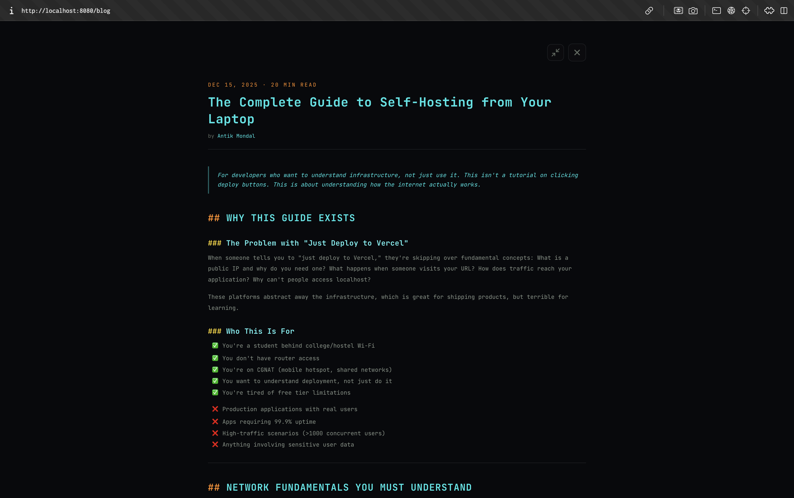

# GUI Portfolio

A **modern, full-stack portfolio website** showcasing projects, blog posts, and professional experience. Built as an industry-standard monorepo with React, TypeScript, and Tailwind CSS.

> A clean, professional GUI-based portfolio complementing my cyberpunk terminal projects — bridging architecture, infrastructure, and product design.

---

## Features

| Feature | Description |
|---------|-------------|
| 👤 **About Me** | Professional background, skills, and current focus |
| 📚 **Blog** | Deep-dive technical articles on infrastructure & DevOps |
| 🎯 **Portfolio** | Showcase of full-stack projects with descriptions |
| 📧 **Contact** | Get in touch with email integration |
| 📄 **Resume** | Downloadable CV and work experience |
| 🎨 **Modern UI** | Dark theme with responsive design |
| ⚡ **Fast & Optimized** | Vite-powered, production-ready |

---

## Preview

### Home & About Section


The portfolio features a sleek dark-themed interface with professional branding. The sidebar provides clean navigation to all sections while the main content area displays:
- **Professional Profile**: Name, title, location, and online status
- **About Section**: Deep dive into background as a B.Tech student at Newton School of Technology, specializing in full-stack development, DevOps, and infrastructure engineering
- **Current Focus**: Founding Ayu Sangrah Bharat, a comprehensive health record platform aimed at transforming healthcare in India
- **Expertise Highlights**: DevOps with Linux automation, healthtech platform development, and cybersecurity

### Blog Post Archive


Technical blog covering infrastructure and DevOps fundamentals:
- Guides on self-hosting applications from home networks (addressing challenges like CGNAT)
- Understanding internet infrastructure and deployment
- Building scalable systems with modern tooling

---

## Tech Stack

| Layer | Technology | Purpose |
|-------|------------|---------|
| **Frontend Framework** | React 19 | Modern UI library |
| **Build Tool** | Vite 7 | Lightning-fast development & production builds |
| **Language** | TypeScript | Type-safe development |
| **Styling** | Tailwind CSS | Utility-first CSS framework |
| **Components** | shadcn/ui + Radix UI | High-quality accessible components |
| **Routing** | React Router | Client-side navigation |
| **Monorepo** | npm workspaces | Scalable project structure |

---

## Project Structure

```
GUI_Portfolio/
├── apps/
│   └── web/                    # Vite + React application
│       ├── src/
│       │   ├── components/     # Reusable UI components
│       │   │   ├── Header.jsx      # Navigation header
│       │   │   ├── Blog.jsx        # Blog listing & posts
│       │   │   ├── BlogPost.jsx    # Individual post view
│       │   │   ├── Layout.jsx      # Page layout wrapper
│       │   │   ├── Sidebar.jsx     # Navigation sidebar
│       │   │   └── ui/             # shadcn/ui components
│       │   ├── pages/          # Page components
│       │   │   ├── Index.tsx       # Home page
│       │   │   ├── About.jsx       # About section
│       │   │   ├── Portfolio.jsx   # Projects showcase
│       │   │   ├── Blog.jsx        # Blog listing
│       │   │   ├── Contact.jsx     # Contact form
│       │   │   ├── Resume.jsx      # Resume page
│       │   │   └── NotFound.jsx    # 404 page
│       │   ├── data/           # Static content
│       │   │   └── blogContent.jsx # Blog post data
│       │   ├── hooks/          # Custom React hooks
│       │   │   ├── use-mobile.tsx
│       │   │   └── use-toast.ts
│       │   ├── lib/            # Utility functions
│       │   │   └── utils.ts
│       │   ├── App.tsx         # Main app wrapper
│       │   ├── main.tsx        # React entry point
│       │   └── index.css       # Global styles
│       ├── vite.config.ts      # Vite configuration
│       ├── tailwind.config.ts  # Tailwind configuration
│       ├── tsconfig.json       # TypeScript config
│       └── package.json
│
├── packages/
│   ├── config/                 # Shared configurations
│   │   ├── eslint.base.js
│   │   ├── tailwind.base.ts
│   │   └── tsconfig.base.json
│   └── ui/                     # Shared UI package (for future expansion)
│
├── package.json                # Root workspace config
└── README.md
```

---

## Getting Started

### Prerequisites
- **Node.js** 18+
- **npm** or **yarn**

### Installation

```bash
# Clone the repository
git clone <repo-url>
cd GUI_Portfolio

# Install all workspace dependencies
npm install
```

### Development

```bash
# Start development server (auto-reload)
npm run dev

# Start web app specifically
npm run dev -w @gui-portfolio/web

# App runs on http://localhost:5173
```

### Production Build

```bash
# Build for production
npm run build

# Preview production build locally
npm run preview

# Lint code for issues
npm run lint
```

---

## About This Project

This portfolio represents my journey into **full-stack development, DevOps, and infrastructure engineering**:

- **Professional Presence**: Modern GUI-based portfolio for clients and recruiters
- **Technical Writing**: Blog posts on self-hosting, infrastructure, and DevOps fundamentals
- **Project Showcase**: Display of full-stack applications built with modern tooling
- **Career Focus**: Building healthtech solutions at Ayu Sangrah Bharat

### Complementary Projects

I'm building a comprehensive suite of projects to understand modern software engineering:

- **Terminal Portfolio (ANTEC)**
  - Linux-inspired CLI portfolio with full authentication
  - Tech: React, Express.js, MongoDB, JWT, Docker
  - Focus: Full-stack architecture, security practices, DevOps fundamentals
  - Learning: Monorepo management, containerization, deployment pipelines

- **TTY.FM (Music Streaming)**
  - Cyberpunk-themed music streaming system
  - Tech: React, Node.js, Tailscale, PM2, WebSocket
  - Focus: Self-hosting infrastructure, reverse tunneling, process management
  - Learning: Understanding internet infrastructure, NAT traversal, secure networking

- **FuckOmegel (Video Chat)**
  - Real-time video chat with cyberpunk aesthetic
  - Tech: React, FastAPI, WebRTC, WebSocket
  - Focus: Real-time communication, peer-to-peer networking
  - Learning: WebRTC signaling, socket programming, browser APIs

---

## Blog & Content

The blog features in-depth technical articles including:
- **Infrastructure & DevOps**: Understanding how servers actually work
- **Self-Hosting**: Hosting applications from home networks without data centers
- **Network Engineering**: CGNAT, reverse tunnels, and Tailscale solutions
- **Full-Stack Development**: Building scalable applications from scratch
- **Security & Deployment**: Best practices for production applications

### Featured Articles
- "The Complete Guide to Self-Hosting from Your Laptop" - A comprehensive guide for developers who want to understand infrastructure, not just use it

---

## Design Philosophy

- **Dark-first aesthetic**: Professional appearance optimized for readability
- **Responsive design**: Mobile, tablet, and desktop optimized
- **Accessible components**: WCAG compliant with Radix UI primitives
- **Performance-focused**: Vite ensures fast load times and build speeds
- **Modern UI patterns**: shadcn/ui components for consistency and reusability

---

## Workspace Commands

```bash
# Run commands across the entire workspace
npm run <script>

# Run in a specific app/package
npm run <script> -w <workspace-name>

# Example: Build only the web app
npm run build -w @gui-portfolio/web
```

---

## Configuration

### TypeScript
- Root config: `packages/config/tsconfig.base.json`
- Web config: `apps/web/tsconfig.json`

### Tailwind CSS
- Base config: `packages/config/tailwind.base.ts`
- Web config: `apps/web/tailwind.config.ts`

### ESLint
- Base config: `packages/config/eslint.base.js`

---

## Learning Goals

This project demonstrates:
- Modern React patterns and hooks
- TypeScript for type safety
- Tailwind CSS for styling at scale
- Monorepo architecture with npm workspaces
- Component-driven development with shadcn/ui
- SEO-friendly portfolio structure
- Responsive design and accessibility

---

## About Me

- **Full-Stack Engineer**: Specializing in DevOps and infrastructure engineering
- **B.Tech Student**: Newton School of Technology, focusing on Computer Science & AI
- **Current Mission**: Co-founding Ayu Sangrah Bharat, a comprehensive health record platform transforming healthcare in India
- **Expertise**: 
  - Full-stack development (React, Node.js, Express)
  - DevOps & Infrastructure (Linux, Docker, Tailscale, PM2)
  - Secure systems design (JWT, encryption, security best practices)
  - Network engineering & deployment

---

## License

This project is part of my portfolio. Feel free to use it as inspiration for your own projects.

---

## 🤝 Connect

- **Email**: itsantikmondal43@gmail.com
- **Location**: Kolkata, India
- **Status**: Online & Open to Opportunities

**Building the future of healthtech at the intersection of technology and business.**
